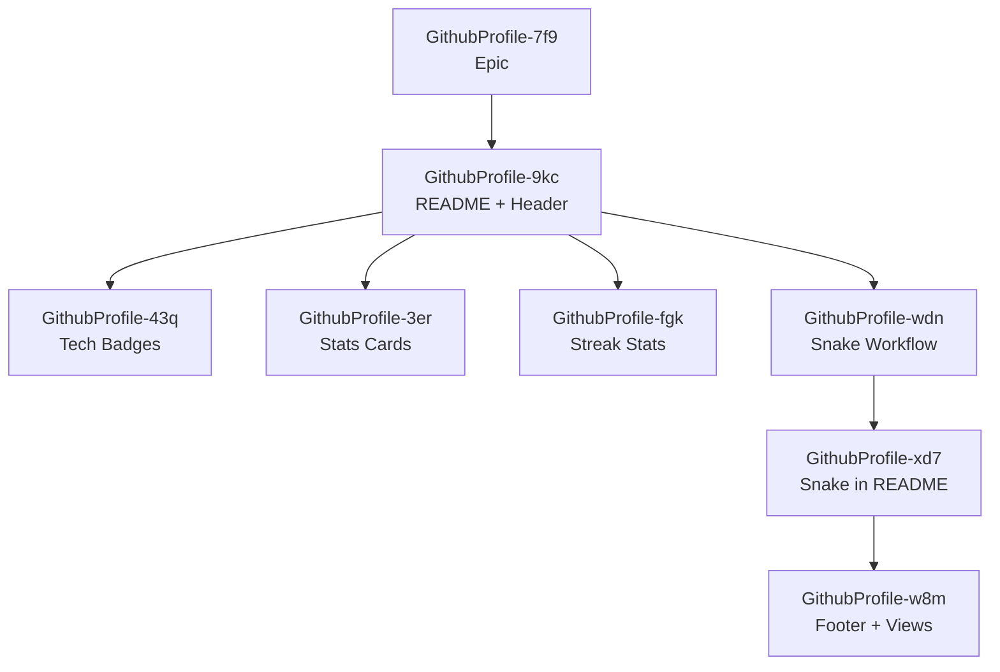

# Execution Plan: GitHub Profile README with Animations

**Epic**: GithubProfile-7f9  
**Generated**: 2026-01-14  

## Dependency Graph

## Tracks (Single Track - Sequential)

| Order | Bead ID | Title | Priority |
|-------|---------|-------|----------|
| 1 | GithubProfile-7f9 | Epic (mark in_progress) | P1 |
| 2 | GithubProfile-9kc | Create README.md with header and about | P1 |
| 3 | GithubProfile-43q | Add tech stack badges | P2 |
| 4 | GithubProfile-3er | Add GitHub stats cards | P2 |
| 5 | GithubProfile-fgk | Add streak stats | P2 |
| 6 | GithubProfile-wdn | Setup snake GitHub Action | P1 |
| 7 | GithubProfile-xd7 | Add snake to README | P2 |
| 8 | GithubProfile-w8m | Add footer and profile views | P3 |

## Parallel Opportunities

After GithubProfile-9kc completes, these can run in parallel:
- GithubProfile-43q (Tech Badges)
- GithubProfile-3er (Stats Cards)  
- GithubProfile-fgk (Streak Stats)
- GithubProfile-wdn (Snake Workflow)

## Files to Create

| File | Bead |
|------|------|
| README.md | GithubProfile-9kc + subsequent |
| .github/workflows/snake.yml | GithubProfile-wdn |

## Starting Point

`bd ready` shows Epic is ready → Start with GithubProfile-9kc (first task)
